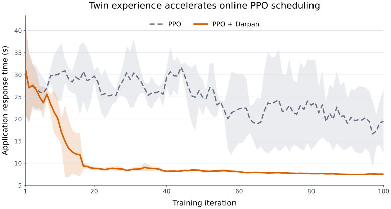

<div align="center">


# Darpan: A Digital Twin Framework for Next-Generation Continuum Computing

[](https://www.python.org/)
[](CHANGELOG.md)
[](LICENSE)

Darpan connects a live Device–Edge–Fog–Cloud runtime to a continuously
calibrated, executable Digital Twin. Controllers can capture the current state,
fork isolated candidate futures, compare their outcomes, and return a selected
action through the physical runtime's normal validation path.

</div>

## Why Darpan?

Continuum controllers must choose placements, routes, recovery actions, and
scheduling decisions before observing their consequences. A physical runtime
can execute only the selected decision, while a conventional simulator usually
starts from a separately configured world.

Darpan makes the current physical execution state itself forkable:

1. Physical execution emits canonical computation, transfer, resource, and
   failure events.
2. An attached Twin mirrors the resulting state and calibrates performance
   models using physical observations only.
3. An immutable snapshot captures state, model versions, virtual time, and
   random state.
4. Candidate scenarios execute in mutually isolated Twin Sessions from that
   same snapshot.
5. An external controller compares the results and submits a canonical Action.
6. The Physical Session validates the Action against its latest state before
   RealBackend execution.

This closed loop lets Darpan support many controllers without embedding a
particular optimizer, scheduler, recovery policy, or learning algorithm.

## Execution model

```text
Physical Continuum / Darpan Agents
                │
                ▼
           RealBackend
                │ canonical Events
                ▼
EventLog → Reducer / StateStore → ContinuumState → Physical Session
                                      │
                                      ▼
                     TwinMirror → ModelRegistry
                                      │
                                      ▼
                                TwinSnapshot
                                      │
                    ┌─────────────────┼─────────────────┐
                    ▼                 ▼                 ▼
               Twin Session π₁  Twin Session π₂   Twin Session πₖ
                    │                 │                 │
                    └──────── SimulationResults ────────┘
                                      │
                              External controller
                                      │ selected Action
                                      ▼
                 latest-state validation → RealBackend
```

Physical and Twin execution share the same stable contract:

```text
Event → EventLog → Reducer → ContinuumState → Session → Action → Backend
```

## Core capabilities

| Capability | What Darpan provides |
| --- | --- |
| Physical execution | Local and remote Agents, real component execution, artifact transfer, resource observation, and failure reporting |
| Executable Twin | Virtual clock, discrete-event execution, DAG dependencies, resource contention, transfer contention, and fault semantics |
| Online synchronization | History replay followed by live `(event, state)` observation from a Physical Session |
| Online calibration | Execution-time, artifact-size, network-delay, and queue-delay models updated from physical evidence |
| Snapshot branching | Immutable state/model snapshots and isolated candidate Twin Sessions |
| Safe action return | Capability, lifecycle, resource, node, and data-reachability validation against the latest physical state |
| Extensible integration | Public application, model, backend, policy, controller, and RL adapter interfaces |
| Scale-out runtime | Asynchronous coordination across independently executing physical Agents |

## Installation

### Requirements

- Python 3.12 or 3.13
- Linux, macOS, or Windows for the Twin runtime
- Linux hosts for physical resource and network control features

### Install Darpan Core

```bash
python -m venv .venv
source .venv/bin/activate        # Windows: .venv\Scripts\activate
python -m pip install --upgrade pip
python -m pip install -e .
```

Core depends on NumPy and PyYAML. It does not depend on PyTorch or a specific
learning framework.

### Optional RL companion

```bash
python -m pip install -e packages/darpan-rl
```

`darpan-rl` supplies reference neural networks, PPO/A2C/A3C implementations,
training utilities, and adapters while keeping the core runtime independent of
the learning stack.

## Quick start

Run the self-contained Twin control-surface example:

```bash
python examples/control/actions.py
```

The example creates a four-node continuum and exercises Darpan's six canonical
controller actions:

| Action | Meaning |
| --- | --- |
| `PLACE` | Place a component instance on a node |
| `STOP` | Terminate a running service or stream instance |
| `RESTART` | Restart a running instance in place |
| `MIGRATE` | Move a running service or stream to another node |
| `SCALE` | Set the desired horizontal replica count |
| `ROUTE` | Bind or clear an explicit path for an application flow |

A minimal Twin session follows the same API used by physical execution:

```python
import asyncio

from darpan import Darpan, LinkSpec, NodeSpec, ResourceSpec, SystemSpec


async def main() -> None:
    system = SystemSpec(
        nodes=(
            NodeSpec("edge", resources=(ResourceSpec("cpu", 2),)),
            NodeSpec("cloud", resources=(ResourceSpec("cpu", 8),)),
        ),
        links=(
            LinkSpec(
                "edge-cloud",
                "edge",
                "cloud",
                latency_ms=10,
                bandwidth_mbps=100,
            ),
        ),
    )

    session = Darpan.twin()
    await session.start()
    try:
        await session.register_system(system)
        print(session.state)
        print(sorted(session.supported_action_kinds))
    finally:
        await session.close()


asyncio.run(main())
```

See [`examples/control/actions.py`](examples/control/actions.py) for application
submission, placement, routing, scaling, restart, migration, and shutdown in one
executable example.

## Snapshot-based exploration

An attached Twin can branch from a running Physical Session without copying a
virtual result back into physical state:

```python
from darpan import DigitalTwin

twin = DigitalTwin().attach(real_session, replay_history=True)
snapshot = twin.snapshot(real_session.state)

candidate = twin.scenario(snapshot).remove_node("edge-2")
result = await twin.simulate(candidate)

# The external controller interprets result.state and result.events,
# then submits a canonical Action to real_session.
```

Every candidate receives its own state store, event log, model registry,
virtual clock, simulation kernel, and backend. The source snapshot remains
unchanged, and virtual observations never calibrate the attached Twin.

## Case study: augmenting an online PPO scheduler

The same PPO scheduler was trained from the same cold-start conditions and
counted physical interaction budget. `PPO + Darpan` additionally learned from
isolated Twin trajectories generated after each counted execution. The x-axis
contains only the 100 primary training iterations; Twin trajectories are not
counted as additional physical interactions.



Curves show a five-iteration trailing mean over ten independent runs; shaded
regions show one standard deviation. Over the final 20 raw training iterations,
mean DAG response time is 19.99 s for PPO and 7.51 s for PPO + Darpan, a 62.4%
reduction for the same online learner.

## Physical deployments

RealBackend maps canonical Actions to local executors or authenticated remote
Darpan Agents. The physical path supports asynchronous start, wait, and cancel;
resource observation; chunked artifact transfer; optional direct Agent-to-Agent
transfer; node and link monitoring; and explicit physical control drivers.

Start with:

- [Physical deployment guide](docs/physical-deployment.md)
- [Architecture overview](docs/architecture/overview.md)
- [Architecture contracts](docs/architecture/contracts.md)
- [Twin refinement guide](docs/twin-refinement.md)

Never commit cluster credentials, private keys, tokens, or machine-specific
deployment inventories to a public repository. Darpan accepts secrets through
environment-variable references and keeps authentication material out of
recorded experiment artifacts.

## Bring your own controller

Darpan's controller boundary is deliberately small:

1. read the current `ContinuumState`;
2. capture a `TwinSnapshot`;
3. create one or more `Scenario` objects;
4. inspect `SimulationResult.state` and `SimulationResult.events`;
5. submit canonical `Action` objects to the Physical Session.

This boundary supports rules, search, mathematical optimization, deployment
policies, recovery policies, DRL schedulers, and multi-objective methods. Darpan
does not require a controller to enumerate every candidate or use a particular
objective.

## Repository layout

```text
src/darpan/
  core/          canonical specifications, Events, Actions, and state
  runtime/       Sessions, reducers, RealBackend, Agents, and orchestration
  twin/          mirror, calibration, models, snapshots, and simulation
  adapters/      policy and optimization integration boundaries
  experiment/    reproducible execution and evidence utilities
  cli/           command-line entry points

packages/darpan-rl/
  src/darpan_rl/ optional reinforcement-learning companion

examples/        executable integration examples
configs/         portable systems, applications, workloads, and scenarios
docs/            architecture and deployment documentation
tests/           unit, contract, integration, and end-to-end tests
```

## Development

Install development dependencies and optional RL package:

```bash
python -m pip install -e ".[dev]"
python -m pip install -e packages/darpan-rl
```

Run quality checks:

```bash
python -m ruff check src packages/darpan-rl/src tests examples
python -m compileall -q src packages/darpan-rl/src
PYTEST_DISABLE_PLUGIN_AUTOLOAD=1 \
  python -m pytest -p pytest_asyncio.plugin tests/unit tests/contract \
  --ignore=tests/contract/test_evaluation_v2_inputs.py
```

Before opening a pull request, also run the integration and end-to-end suites
relevant to the backend or controller interface you changed.

See [CONTRIBUTING.md](CONTRIBUTING.md) for the contribution workflow and
[SECURITY.md](SECURITY.md) for private vulnerability reporting guidance.

## Citation

If Darpan supports your research, cite the software release and the associated
paper. Machine-readable metadata is provided in [`CITATION.cff`](CITATION.cff).

```bibtex
@software{darpan2026,
  title   = {Darpan: A Digital Twin Framework for Next-Generation Continuum Computing},
  year    = {2026},
  version = {0.2.0.dev27},
  license = {Apache-2.0}
}
```

## License

Darpan is released under the [Apache License 2.0](LICENSE).
